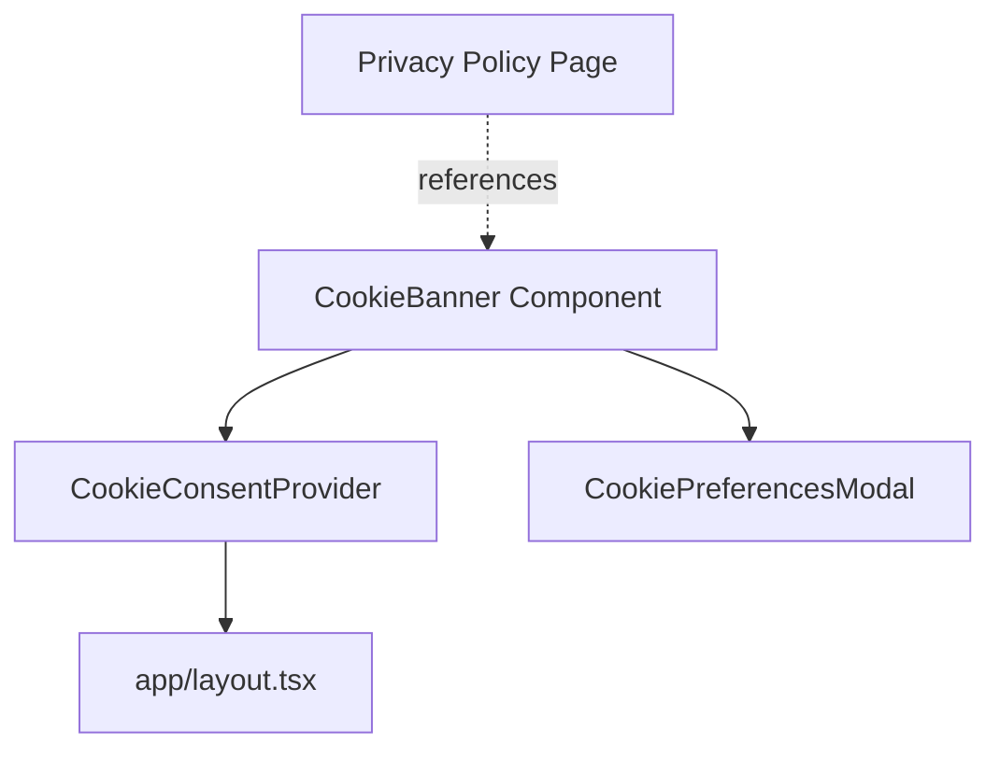
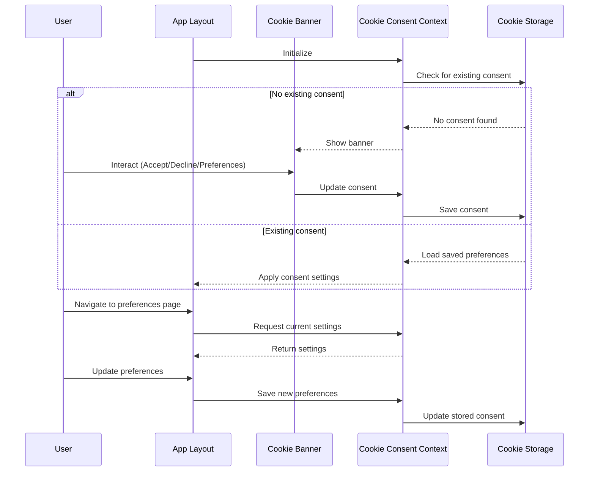

# Cookie Banner Implementation Plan

## Summary of Requirements

- **Cookie Types**: Essential cookies for site functionality, with plans to add analytics cookies in the future
- **Banner Design**: Non-intrusive banner at the bottom of the screen with Accept/Decline options
- **Compliance**: Full GDPR compliance, including the ability for users to change preferences later
- **Integration Point**: Likely in app/layout.tsx as a global component

## Detailed Implementation Plan

### 1. Component Structure



### 2. Implementation Steps

#### Phase 1: Create Core Components

1. **Create a CookieConsentContext**
   - Location: `contexts/CookieConsentContext.tsx`
   - Purpose: Manage consent state and provide methods to update preferences
   - Features:
     - Store consent status (accepted, declined, not set)
     - Track individual cookie category preferences (essential, analytics)
     - Provide methods to update preferences

2. **Create a CookieBanner Component**
   - Location: `components/CookieBanner.tsx`
   - Purpose: Display the banner UI when consent is not yet provided
   - Features:
     - Non-intrusive banner at bottom of screen
     - Accept/Decline buttons
     - Link to privacy policy
     - Link to open detailed preferences

3. **Create a CookiePreferencesModal Component**
   - Location: `components/CookiePreferencesModal.tsx`
   - Purpose: Allow users to manage detailed cookie preferences
   - Features:
     - Toggle for each cookie category
     - Save preferences button
     - Accessible from cookie banner and potentially from footer/settings

#### Phase 2: Storage Implementation

4. **Implement Cookie Consent Storage**
   - Location: `lib/cookieConsent.ts`
   - Purpose: Handle saving and retrieving consent preferences
   - Implementation Options:
     - **Recommended: HTTP-only Cookies**
       - More secure than localStorage
       - Server-accessible for SSR components
       - Leverages existing Supabase cookie handling utilities
     - Alternative: localStorage (simpler but less secure)
   - Features:
     - Save consent status
     - Save individual category preferences
     - Implement with expiration (e.g., 6 months) for GDPR compliance

#### Phase 3: Integration

5. **Integrate with Application Layout**
   - Location: `app/layout.tsx`
   - Purpose: Make cookie banner available globally
   - Implementation:
     - Wrap application in CookieConsentProvider
     - Add CookieBanner component to layout
     - Ensure it appears above all other content

6. **Add Privacy Policy References**
   - Update privacy policy page to include specific information about:
     - Cookie categories used
     - Purpose of each cookie
     - How to manage preferences

7. **Create Cookie Management Page/Section**
   - Location: `app/cookie-preferences/page.tsx` or section in user settings
   - Purpose: Allow users to update preferences after initial decision
   - Features:
     - Same interface as the preferences modal
     - Accessible from footer or settings

### 3. Technical Considerations

#### Component Design

- Use existing UI components:
  - `Alert` component for the banner base
  - `Dialog` component for the preferences modal
  - `Button` components for actions

#### Storage Approach

For GDPR compliance, I recommend using HTTP-only cookies with the following structure:

```typescript
interface CookieConsent {
  necessary: boolean;  // Always true, cannot be disabled
  analytics: boolean;  // Can be toggled by user
  marketing?: boolean; // For future expansion
  preferences?: boolean; // For future expansion
  lastUpdated: string; // ISO date string for compliance
}
```

The application already has cookie handling utilities in `lib/supabase/client.ts` and `lib/supabase/server-client.ts` that can be leveraged.

#### GDPR Compliance Checklist

- [ ] Banner appears before any non-essential cookies are set
- [ ] Clear explanation of cookie purposes
- [ ] Ability to accept/decline non-essential cookies
- [ ] Granular control over different cookie categories
- [ ] Easy access to change preferences later
- [ ] Consent expiration (recommended: 6 months)
- [ ] Record of when consent was given/updated

## Implementation Diagram



## Next Steps

1. Create the necessary components and context
2. Implement the storage mechanism
3. Integrate with the application layout
4. Test across different scenarios
5. Ensure GDPR compliance